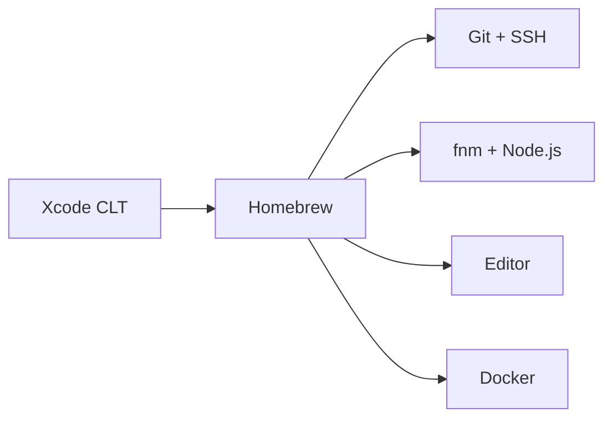

Montar um ambiente de desenvolvimento no macOS pode parecer intimidante, especialmente se você vem do Windows ou Linux. Mas com as ferramentas certas, o processo é direto e o resultado é um setup produtivo.

## Pré-requisitos

Antes de começar, certifique-se de que seu Mac está atualizado e que você tem acesso ao terminal. O Terminal.app vem instalado por padrão, mas considere usar alternativas como o iTerm2 ou o Ghostty.

### Xcode Command Line Tools

Muitas ferramentas dependem dos Xcode Command Line Tools. Instale com:

```bash
xcode-select --install
```

Isso instala compiladores, Git e outras utilidades essenciais sem precisar do Xcode completo.

## Homebrew: o gerenciador de pacotes

O Homebrew é o gerenciador de pacotes não oficial do macOS. Com ele, você instala praticamente qualquer ferramenta de desenvolvimento.

### Instalação

```bash
/bin/bash -c "$(curl -fsSL https://raw.githubusercontent.com/Homebrew/install/HEAD/install.sh)"
```

### Comandos básicos

- `brew install` — instalar um pacote
- `brew upgrade` — atualizar pacotes
- `brew list` — listar instalados
- `brew search` — buscar pacotes

### Casks vs fórmulas

Fórmulas são pacotes de linha de comando. Casks são aplicativos com interface gráfica:

```bash
brew install git          # fórmula
brew install --cask firefox  # cask
```

## Configurando o Git

O Git já vem com o Xcode CLT, mas vale configurar sua identidade:

```bash
git config --global user.name "Seu Nome"
git config --global user.email "seu@email.com"
```

### Chave SSH para GitHub

Gere uma chave SSH e adicione ao GitHub para autenticação sem senha:

```bash
ssh-keygen -t ed25519 -C "seu@email.com"
eval "$(ssh-agent -s)"
ssh-add ~/.ssh/id_ed25519
```

Copie a chave pública e adicione em GitHub > Settings > SSH Keys:

```bash
pbcopy < ~/.ssh/id_ed25519.pub
```

#### Testando a conexão

```bash
ssh -T git@github.com
```

Se tudo estiver certo, você verá uma mensagem de boas-vindas.

## Node.js e gerenciadores de versão

Não instale o Node.js diretamente. Use um gerenciador de versão para alternar entre versões conforme o projeto.

### fnm (Fast Node Manager)

```bash
brew install fnm
fnm install --lts
fnm use --lts
```

### Verificando a instalação

```bash
node --version
npm --version
```

## Editor de código

O editor é questão de preferência pessoal, mas aqui estão as opções mais populares:

### VS Code

O mais usado atualmente. Instale via Homebrew:

```bash
brew install --cask visual-studio-code
```

#### Extensões recomendadas

- ESLint
- Prettier
- GitLens
- Material Icon Theme

### Alternativas

- **Zed**: editor nativo, rápido, feito em Rust
- **Neovim**: para quem prefere o terminal
- **Cursor**: VS Code com IA integrada

## Docker (opcional)

Para projetos que precisam de containers:

```bash
brew install --cask docker
```

Após instalar, abra o Docker Desktop para completar a configuração. No Apple Silicon, o Docker roda nativamente via virtualização ARM.

### Verificando

```bash
docker --version
docker compose version
```

## Visão geral do setup

O fluxo de instalação segue esta ordem:



## Conclusão

Com Homebrew, Git, Node.js e um bom editor, você tem a base para trabalhar com praticamente qualquer stack web moderna. Personalize conforme suas necessidades e aproveite o ecossistema macOS.
