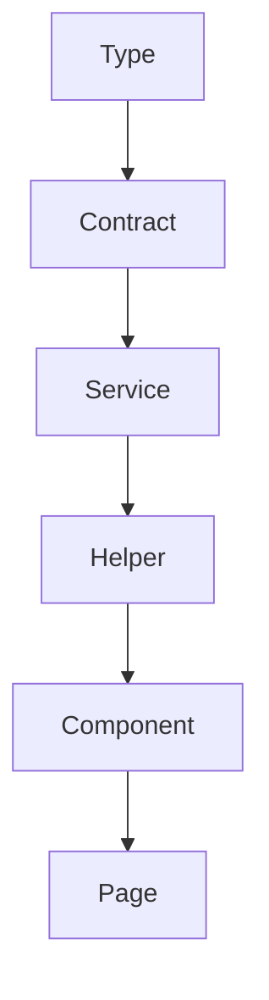

arquiteturas-de-software-evolucao-e-boas-praticas

Arquitetura de software não é receita pronta. É um conjunto de decisões que evolui conforme as necessidades do seu projeto.

Não existe a arquitetura certa. Existe a arquitetura que faz sentido para o contexto atual do seu sistema. E mais importante: ela **precisa evoluir com o tempo**.

## O conceito de domínio

Antes de falar sobre camadas e estruturas, precisamos entender o que é um **domínio**.

### O que é domínio?

Domínio é uma parte lógica do seu sistema que representa um conceito de negócio.

Exemplos em um sistema de biblioteca:

* **Livros:** cadastro, informações, categorias
    
* **Autores:** dados dos escritores
    
* **Empréstimos:** controle de quem pegou qual livro
    
* **Autenticação:** login, permissões
    
* **Notificações:** envio de emails, alertas
    

Domínio é diferente de *feature*. Um domínio pode conter várias *features*, e *features* podem interagir com múltiplos domínios.

*Na prática: domínio grande ≈ módulo do sistema.*

## Evolução de arquitetura back-end

Vamos ver como uma arquitetura *back-end* evolui naturalmente conforme o projeto cresce.

A base é o padrão **MVC** (*model-view-controller*), mas em APIs REST, a camada de *view* perde relevância, já que não há interface visual, ou seja, o *controller* retorna os dados diretamente como JSON.

Por isso, na prática, trabalhamos mais com **MC** (*model-controller*) e suas variações com *services* e *repositories*.

Existem outras abordagens como a arquitetura hexagonal, que tem seus méritos em projetos de grande porte, mas para a maioria dos cenários pode gerar complexidade desnecessária para o contexto.

Neste artigo não iremos entrar em detalhes sobre a arquitetura hexagonal.

**Regra de ouro:** arquitetura tem que fazer sentido no seu projeto.

### Nível 1: rotas → controller → model

**Quando usar:** projetos pequenos, MVPs, protótipos.

Estrutura:

```plaintext
/routes/api.php
/app/Controllers/BookController.php
/app/Models/Book.php
```

Exemplo:

```php
// routes/api.php
Route::get('/books', [BookController::class, 'index']);
Route::get('/books/{id}', [BookController::class, 'show']);
```

```php
// BookController.php
class BookController {
    public function index() {
        return Book::all();
    }
    
    public function show($id) {
        return Book::find($id);
    }
}
```

```php
// Book.php (Model com Eloquent ORM)
class Book extends Model {
    protected $fillable = ['title', 'author', 'published_year'];
    // Eloquent, assim como outros ORMs do mercado, já fornecem: find(), all(), where()
}
```

Para sistemas simples, adicionar camadas extras é *overhead* desnecessário.

### Nível 2: rotas → controller → service → model

**Quando evoluir:**

* Código duplicado em múltiplos *controllers*
    
* Validações repetidas
    
* Lógica de negócio complexa
    
* Regras de permissão em vários lugares
    

Estrutura:

```plaintext
/routes/api.php
/app/Controllers/BookController.php
/app/Services/BookService.php
/app/Models/Book.php
```

Conforme o projeto cresce, o *model* acompanha essa evolução. Agora temos novos campos para controlar disponibilidade e categorização:

```php
// Book.php atualizado
class Book extends Model {
    protected $fillable = ['title', 'author', 'published_year', 'available', 'category_id'];
}
```

Exemplo:

```php
// BookController.php
class BookController {
    public function __construct(
        private BookService $bookService
    ) {}
    
    public function index() {
        $books = $this->bookService->getAllAvailableBooks();

        return $books;
    }
}
```

```php
// BookService.php
class BookService {
    public function getAllAvailableBooks() {
        return Book::query()
            ->where('available', true)
            ->orderBy('title')
            ->get();
    }
    
    public function findBookById($id) {
        $book = Book::find($id);
        
        if (!$book) {
            throw new BookNotFoundException();
        }

        return $book;
    }
}
```

Benefícios:

* *Controller* simples (só orquestra requisições)
    
* Lógica de negócio centralizada
    
* Fácil de testar
    
* Reutilização de código
    

### Nível 3: rotas → controller → service → repository → model

**Quando evoluir:**

* *Queries* muito complexas
    
* Múltiplas fontes de dados
    
* Trocar implementação de banco sem afetar *service*
    
* Separar completamente regra de negócio de acesso a dados
    

Estrutura:

```plaintext
/routes/api.php
/app/Controllers/BookController.php
/app/Services/BookService.php
/app/Repositories/BookRepository.php
/app/Models/Book.php
```

Com a complexidade crescendo, o *model* ganha relacionamentos com outros *models* do sistema.

Os campos e queries dos níveis anteriores se mantêm. A novidade está nos relacionamentos:

```php
// Book.php (Model com relacionamentos)
class Book extends Model {
    protected $fillable = ['title', 'author', 'published_year', 'available', 'category_id'];

    public function category(): BelongsTo
    {
        return $this->belongsTo(BookCategory::class);
    }

    public function copies(): HasMany
    {
        return $this->hasMany(Copy::class);
    }
}
```

Exemplo:

```php
// BookRepository.php
class BookRepository {
    public function findAvailableBooks() {
        return Book::query()
            ->where('available', true)
            ->whereHas('copies', function ($q) {
                $q->where('condition', '!=', 'damaged');
            })
            ->with(['category', 'copies'])
            ->orderBy('title')
            ->get();
    }
    
    public function findByFilters(array $filters) {
        $query = Book::query();
        
        if (isset($filters['search'])) {
            $query->where(function ($q) use ($filters) {
                $q->where('title', 'like', "%{$filters['search']}%")
                  ->orWhere('author', 'like', "%{$filters['search']}%");
            });
        }
        
        if (isset($filters['category_id'])) {
            $query->where('category_id', $filters['category_id']);
        }
        
        if (isset($filters['year_from'])) {
            $query->where('published_year', '>=', $filters['year_from']);
        }
        
        return $query->orderBy('title')->get();
    }
}
```

Perceba que o `findAvailableBooks` mantém a mesma base do nível anterior (`where('available', true)`, `orderBy('title')`) e adiciona a complexidade dos relacionamentos.

Enquanto isso, o `findByFilters` é um método novo que justifica a existência do *repository*: busca textual em múltiplos campos + filtros combinados.

```php
// BookService.php simplificada
class BookService {
    public function __construct(
        private BookRepository $repository
    ) {}
    
    public function getAllAvailableBooks() {
        return $this->repository->findAvailableBooks();
    }
    
    public function searchBooks(array $criteria) {
        return $this->repository->findByFilters($criteria);
    }
}
```

**Importante:** Em *frameworks* com ORM robusto (**Laravel**/Eloquent), a camada de *repository* pode ser exagerada para projetos pequenos, já que o *Model* já funciona como *repository*.

A necessidade real aparece quando *queries* envolvem relacionamentos, filtros combinados e buscas textuais. Manter essa lógica no *service* polui a camada de negócio.

## Comparação: Laravel vs frameworks sem ORM

### Laravel (com Eloquent ORM)

```php
class Book extends Model {
    protected $fillable = ['title', 'author', 'published_year', 'available', 'category_id'];
    // Automaticamente tem:
    // - Book::find($id)
    // - Book::all()
    // - Book::where(...)
    // - Relationships
}
```

Pode fazer: *Controller* → *Model* ou *Controller* → *Service* → *Model*.

### Frameworks sem ORM (Exemplo: Slim PHP)

```php
// Model representa a estrutura da tabela no banco de dados

class Book {
    public int $id;
    public string $title;
    public string $author;
    public int $publishedYear;
    public bool $available;
    public int $categoryId;
}
```

```php
// Repository faz tudo manualmente.

// É possível simplificar com *factories*, o que gera mais uma camada na arquitetura.
// Não iremos abordar esta camada neste artigo.

class BookRepository {
    public function find($id) {
        $stmt = $this->db->prepare("
            SELECT id, title, author, published_year, available, category_id
            FROM books 
            WHERE id = :id
        ");

        $stmt->execute(['id' => $id]);
        $data = $stmt->fetch();
        
        $book = new Book();
        $book->id = $data['id'];
        $book->title = $data['title'];
        $book->author = $data['author'];
        $book->publishedYear = $data['published_year'];
        $book->available = (bool) $data['available'];
        $book->categoryId = $data['category_id'];
        
        return $book;
    }
}
```

Sugerido: *Controller* → *Service* → *Repository/DAO* → *Model*

> É interessante destacar que é possível usar Slim + Eloquent sem nenhum problema. Já vi em sistemas de produção e funciona muito bem.

### Nomenclatura: DAO

**DAO** (*Data Access Object*) é um padrão muito similar ao *repository* e na prática muitas equipes tratam como sinônimo.

A diferença conceitual é que **DAO** é orientado à tabela (um **DAO** por tabela), enquanto *repository* é orientado ao domínio (um *repository* por agregado/entidade de negócio).

Em projetos menores, essa distinção raramente importa, então fique tranquilo.

---

Com o back-end organizado em camadas bem definidas, a pergunta que surge naturalmente é: como aplicar essas mesmas ideias no front-end? A resposta não é uma cópia direta, já que o front-end tem necessidades e restrições próprias, mas os princípios de separação de responsabilidades se mantêm e ganham uma forma própria.

## Arquitetura front-end

A arquitetura *front-end* evoluiu muito nos últimos anos. Até recentemente (2023), era difícil encontrar boas referências sobre arquitetura *front-end*, especialmente em português.

### Abordagens de organização

Existem três formas principais de organizar um projeto *front-end*:

1. **Por tipo de arquivo** (*types*, *components*, *services*, *helpers*)
    
2. **Por *feature*/domínio** (*books*, *auth*, *users*)
    
3. **Híbrida** (mistura das duas)
    

Abaixo, falaremos sobre uma arquitetura ***types-first*** que provou ser escalável, testável e reutilizável em uma equipe com aproximadamente 10 desenvolvedores *front-end*, além de mais alguns desenvolvedores *full-stack.*

### Arquitetura *types-first*

Esta arquitetura prioriza camadas agnósticas de *framework*, permitindo:

* Reutilização entre **React**, **Vue**, **Angular** ou qualquer outro *framework*
    
* Testes simples (sem dependências de UI)
    
* *Onboarding* facilitado (lógica separada de componentes)
    

#### Estrutura

```plaintext
/src
  /types
    Book.type.ts
    Authentication.type.ts
  /contracts
    Book.contract.ts
    Authentication.contract.ts
  /services
    Book.service.ts
    Authentication.service.ts
  /helpers
    Book.helper.ts
    Date.helper.ts
  /components
    /Book
      BookList.tsx
      BookCard.tsx
    /Authentication
      LoginForm.tsx
    /shared
      Button.tsx
  /pages
    /livros
      Books.page.tsx
```

Você deve ter reparado que usamos *“livros”* no diretório do componente `Books.page.tsx`.

Isso é opcional e lembra bastante o estilo de roteamento do **Next.js**, mas diferente do **Next**, o objetivo neste caso é puramente legibilidade e manutenibilidade. A ideia não é algo funcional.

Normalmente, para funcionalidade, eu uso **React Router** e configuro as rotas em um `Router.tsx` ou `Router.ts`.

Percebe como é mais fácil encontrar e descobrir qual componente é renderizado no navegador quando acesso *“app.livraria/livros“.*? É este o objetivo dessa decisão.

#### Ordem comum de desenvolvimento



> **Importante:** As 4 primeiras camadas são **99,99% agnósticas de *framework*** (*imports* de **React**, **Vue** ou qualquer biblioteca UI). A exceção para esta regra são os domínios de front-end e *helpers* com alguns métodos bem específicos, que serão explicados a seguir.

### Camada 1: Type

Define os tipos base do sistema. São espelhos dos tipos do *back-end*.

Para facilitar *imports* e melhorar a experiência de desenvolvimento, use *namespaces*:

```tsx
// backend/src/models/Book.php
class Book extends Model {
    protected $fillable = ['title', 'author', 'published_year', 'available', 'category_id'];
}

// frontend/src/types/Book.type.ts
export namespace Book {
    // Book.php (Model)
    export type Model = {
        id: number;
        title: string;
        author: string;
        publishedYear: number;
        available: boolean;
        categoryId: Category.Model['id'];
    }
    
    export namespace Category {
        // BookCategory.php (Model)
        export type Model = {
            id: number;
            title: string;
        }
    }
}
```

**Quando criar aqui:**

* Tipos que vêm do *back-end*
    
* Tipos compartilhados entre múltiplos domínios
    
* Tipos base do sistema
    

**Quando NÃO criar aqui:**

* Tipos usados só dentro de um componente, como *props*.
    

Uso:

```tsx
import { Book } from '@/types/Book.type';

const book: Book.Model = { /* ... */ };
const category: Book.Category.Model = { /* ... */ };
```

**Vantagem:** Em vez de importar 50 tipos diferentes, você importa um `namespace` e usa o *intellisense* da IDE.

### Camada 2: Contract

Define os contratos de comunicação com a API. É uma extensão da camada **Type**.

```tsx
// contracts/Book.contract.ts
import { Book } from '@/types/Book.type';

export namespace GetBooks {
    export type Response = {
        data: Book.Model[];
        total: number;
        page: number;
    }
}

export namespace CreateBook {
    export type Body = {
        title: string;
        author: string;
        publishedYear: number;
    }

    export type Response = {
        success: boolean;
        data: Book.Model;
    }
}
```

**Por que separar de Type?**

* *Types* são os dados puros
    
* *Contracts* são as estruturas de *request*/*response* da API
    
* Se a API mudar a estrutura, só atualizamos *contracts,* enquanto *types* ficam estáveis
    

### Camada 3: Service

Comunicação com API e lógica de negócio do *front-end*.

```tsx
// services/Book.service.ts
import axios from 'axios';
import { GetBooks, CreateBook } from '@/contracts/Book.contract';

const baseUrl = '/api/v2/books';

export const getBooks = async (): Promise<GetBooks.Response> => {
    const response = await axios.get(baseUrl);

    return response.data;
};

export const createBook = async (body: CreateBook.Body): Promise<CreateBook.Response> => {
    const response = await axios.post(baseUrl, body, {
        headers: { 'Content-Type': 'application/json' }
    });

    return response.data;
};
```

**Responsabilidades:**

* Fazer chamadas HTTP
    
* Autenticação (*tokens*, *headers*)
    
* Tratamento de erros de rede
    
* *Retry logic*
    

**NÃO deve ter:**

* *Imports* de **React**
    
* Manipulação de estado de componentes
    
* Lógica de renderização
    

> **Importante**: Hoje em dia eu prefiro combinar as duas camadas (**Contract** e **Service**) em uma única camada, pensando em melhor escalabilidade, legibilidade e experiência de desenvolvimento. Facilita trabalhar com agentes de IA também, já que as coisas ficam no mesmo arquivo. É um nível a mais de complexidade, então ficou de fora do artigo principal. Vou falar melhor sobre em um próximo artigo.

### Camada 4: Helper

Funções puras TypeScript para manipulação de dados.

```tsx
// helpers/Book.helper.ts
import { Book } from '@/types/Book.type';

export function formatBookTitle(book: Book.Model): string {
    return `${book.title} (${book.publishedYear})`;
}
```

```tsx
// helpers/Date.helper.ts
export function isValidYear(year: number): boolean {
    const currentYear = new Date().getFullYear();
    return year >= 1000 && year <= currentYear;
}

export function formatDate(date: string): string {
    return new Date(date).toLocaleDateString('pt-BR');
}
```

**99,99% dos casos não envolvem React/Framework, mas sim:**

* Formatação de dados
    
* *Parsing* de respostas
    
* Validações
    
* Cálculos
    
* Transformações
    

O uso de **React/Framework** dentro de uma **Helper** é muito específico e na maioria das vezes envolve o uso de ícones, por mais engraçado que isso possa parecer.

Mesmo tendo trabalhado com mais de 60 *helpers* nos últimos anos, esse foi o único caso de uso para **React** dentro de uma *helper* `tsx` que eu experimentei até a escrita deste artigo.

### Camada 5: Component

E agora já podemos usar **React** *(ou Vue.js, por exemplo)*.

Nesta camada, a organização dos componentes já trabalha por domínios, diferente das outras camadas:

```tsx
// components/Book/BookList.tsx
import { useQuery } from '@tanstack/react-query';
import { List, Skeleton, Alert } from 'antd';
import { Book } from '@/types/Book.type';
import { getBooks } from '@/services/Book.service';
import { formatBookTitle } from '@/helpers/Book.helper';

type BookListErrorProps = { error: unknown };

const BookListSkeleton = () => (
    <List>
        {Array.from({ length: 4 }).map((_, index) => (
            <List.Item key={index}>
                <Skeleton active paragraph={{ rows: 1 }} />
            </List.Item>
        ))}
    </List>
);

const BookListError = ({ error }: BookListErrorProps) => {
    const message = error instanceof Error 
        ? error.message 
        : 'Ocorreu um erro inesperado';

    return (
        <Alert
            message="Erro ao carregar livros"
            description={message}
            type="error"
            showIcon
        />
    );
};

export function BookList() {
    const { 
        data: books, 
        isLoading, 
        isError, 
        error 
    } = useQuery({ queryKey: ['books'], queryFn: getBooks });

    if (isLoading)
        return <BookListSkeleton />;
    if (isError)
        return <BookListError error={error} />;

    const renderBookItem = (book: Book.Model) => (
        <List.Item key={book.id}>
            {formatBookTitle(book)}
        </List.Item>
    );

    return (
        <List
            dataSource={books.data}
            renderItem={renderBookItem}
        />
    );
}
```

**Tipos locais de componentes:**

```tsx
// components/Book/BookForm.tsx
import { Form, Input, InputNumber, Button } from 'antd';
import { createBook } from '@/services/Book.service';
import { CreateBook } from '@/contracts/Book.contract';

// Não é adicionado em `types/Book.type.ts`
type Values = {
    title: string;
    author: string;
    publishedYear: number;
};

export function BookForm() {
    const [form] = Form.useForm<Values>();
    
    const handleSubmit = async (values: Values) => {
        const { title, author, publishedYear } = values;
        
        const body: CreateBook.Body = {
            title,
            author,
            publishedYear
        };
        
        await createBook(body);
        form.resetFields();
    };
    
    return (
        <Form<Values>
            form={form}
            onFinish={handleSubmit}
        >
            {/* Pseudo code: ['title', 'author', 'publishedYear'].map(Form.Item) */}
        </Form>
    );
}
```

> Perceba que `Values` é idêntico a `CreateBook.Body` neste exemplo, mas isso porque estamos falando de um exemplo muito simples.
> 
> É comum em formulários mais complexos que a estrutura não seja 1:1 para a rota do back-end, então mesmo que pareça repetitivo, não relacione ou use o mesmo tipo.

### Domínios específicos do front-end

Existem domínios que são apenas do front-end e não são um espelho do back-end.

#### Service.type.ts

Define tipos de respostas genéricas da API:

```tsx
// types/Service.type.ts
export namespace Service {
    export type ApiResponse<T> = {
        success: boolean;
        data: T;
        error?: string;
    }
}
```

#### Service.helper.ts

Funções utilitárias para *services*:

```tsx
// helpers/Service.helper.ts
import { Service } from '@/types/Service.type';

export function hasError<T>(
    response: Service.ApiResponse<T>
): boolean {
    return !response.success || !!response.error;
}

export function getErrorMessage<T>(
    response: Service.ApiResponse<T>
): string {
    return response.error ?? 'Erro desconhecido';
}
```

> Você deve ter percebido que os *contracts* (`GetBooks.Response`, `CreateBook.Response`) não utilizam `Service.ApiResponse<T>`. Isso acontece porque o back-end de exemplo deste artigo não trabalha com uma estrutura padronizada de respostas de API. Os *controllers* retornam as *models* diretamente. Em um projeto de produção, deveríamos nos preocupar com uma estrutura consistente de respostas, incluindo tratamento de erros, e aí sim `Service.ApiResponse<T>` entraria como base dos *contracts*.

#### Authentication.type.ts

Autenticação é uma **exceção**. É muito comum que tenha coisas de back-end e front-end.

```tsx
// types/Authentication.type.ts
export namespace Auth {
    // User.php (Model)
    export type User = {
        id: number;
        name: string;
        email: string;
    }

    // Chaves de armazenamento no IndexedDB/LocalStorage
    export type StoreKeys = 'jwt' | 'user_name';
    
}
```

#### Redux.type.ts

Este exemplo é bem interessante, porque durante a etapa de revisão por IA generativa (**Claude Opus)**, ele me trouxe a seguinte sugestão de melhoria:

> `Redux.type.ts` **contradiz a filosofia agnóstica**
> 
> Nomear um domínio de front-end com o nome de uma biblioteca específica (`Redux`) vai contra a ideia de ser agnóstico de framework que o artigo defende com tanta clareza. Se amanhã o Redux for substituído por Zustand (que é inclusive algo que você já está fazendo), o nome do arquivo perde sentido. Sugiro renomear para algo como `State.type.ts` ou `Store.type.ts`, com o namespace ajustado de `Redux` para `State` ou `Store`.

Sinceramente, ele não está exatamente errado, mas por outro lado, abstrair tudo gera mais problemas do que soluções na maioria dos casos.

Eu não espero poder reutilizar *stores* do Redux com o mesmo contrato em *stores* do Zustand, principalmente se for com outro *framework*, então não vejo problema em ser algo específico para bibliotecas. Perceba que até mesmo aqui existem *trade-offs*. Divertido, não?

```tsx
// types/Redux.type.ts
export namespace Redux {
    export type FormState = {
        isSubmitting: boolean;
        isDirty: boolean;
        errors: Record<string, string>;
    }
    
    export type LoadingState = {
        isLoading: boolean;
        error: string | null;
    }
}
```

**Conclusão:**

* Domínios do back-end são espelho.
    
* Domínios do front-end são específicos da camada de apresentação.
    

### Benefícios da arquitetura *types-first*

#### 1\. Testabilidade

Testar funções puras sem React é dezenas de vezes mais fácil:

```tsx
import { formatBookTitle } from '@/helpers/Book.helper';
import { Book } from '@/types/Book.type';

// Arrange, Act, Assert (AAA): Padrão clássico de organização de testes
test('formats book title', () => {
    // Arrange
    const book: Book.Model = { 
        id: 1,
        title: 'Clean Code', 
        publishedYear: 2008,
        author: 'Martin',
        available: true,
        categoryId: 1
    };
    
    // Act
    const formattedTitle = formatBookTitle(book);
    
    // Assert
    expect(formattedTitle).toBe('Clean Code (2008)');
});
```

#### 2\. Reutilização entre frameworks

Trocar de *framework* é incomum, mas ter uma API sendo usada por N aplicações de front-end já é mais comum. É nesse tipo de situação que essa arquitetura brilha e evita código duplicado entre N repositórios/aplicações de front-end.

Simplesmente transformamos as camadas iniciais em um pacote e disponibilizamos para outros repositórios ou no mesmo repositório, caso estejamos usando soluções como [Turborepo](https://turborepo.dev/).

```tsx
// React
import { useBooks } from '@/components/Book/useBooks';
import { formatBookTitle } from '@/helpers/Book.helper';

function MyReactComponent() {
    const { books, isLoading } = useBooks();
    // ...
}
```

```tsx
// Vue
import { getBooks } from '@/services/Book.service';
import { formatBookTitle } from '@/helpers/Book.helper';
import type { Book } from '@/types/Book.type';

export default {
    setup() {
        const books = ref<Book.Model[]>([]);
        
        onMounted(async () => {
            const response = await getBooks();
            books.value = response.data;
        });
        // ...
    }
}
```

```tsx
// Angular
import { getBooks } from '@/services/Book.service';
import { formatBookTitle } from '@/helpers/Book.helper';
import type { Book } from '@/types/Book.type';

@Component({...})
export class BookComponent {
    books: Book.Model[] = [];
    
    ngOnInit() {
        getBooks().then(response => {
            this.books = response.data;
        });
    }
    // ...
}
```

Sem código duplicado, sem trabalho extra. Percebe agora o valor de uma arquitetura bem pensada?

#### 3\. Onboarding facilitado

Desenvolvedor novo não precisa saber **React** para trabalhar nas camadas agnósticas:

* *"Crie o tipo* `Book`*"*
    
* *"Crie o contrato* `GetBooksResponse`*"*
    
* *"Crie o método service* `getBooks`*"*
    
* *"Crie o método helper* `formatBookTitle`*"*
    

Perceba que nenhuma das tarefas acima tem relação com **React** ou outros *frameworks*, como **Angular**. Dessa forma, o aprendizado é linear e mais aprofundado. Não pulamos direto para *frameworks* e assim novos colaboradores conseguem absorver facilmente o conhecimento.

#### 4\. Manutenção simplificada

Imagine que a rota da **API** mudou de versão ou pior ainda, mudou o caminho todo. Isso acontece normalmente em refatorações do back-end, mesmo que não tão comum, já que se torna uma ***breaking change***.

Além disso e muito mais comum, temos o cenário de trabalhar com *mocks* enquanto o desenvolvedor back-end ainda está trabalhando nas rotas. Quando as rotas estão prontas, é só remover o *mock* na *service* e pronto: Todos os componentes e páginas que usam esta *service* agora estão atualizados e consumindo o back-end de verdade.

### Arquitetura alternativa: *domain-first*

Existe também a abordagem por domínio:

```plaintext
/src
  /domains
    /books
      /types
      /services
      /components
    /auth
      /types
      /services
      /components
  /shared
```

É muito comum no back-end e eu mesmo uso ela normalmente, mas não senti necessidade de usar ela no front-end até hoje, mesmo em projetos maiores, onde aproximadamente 10 desenvolvedores front-end atuam diariamente.

Talvez realmente seja melhor, mas será que vale o custo de migração e treinamento/aprendizado? É um ponto importante a se pensar. Só testando para saber.

## Conclusões

### Arquitetura depende do contexto

Não existe arquitetura perfeita. Existe a arquitetura que faz sentido para:

* Seu time
    
* Quantidade de pessoas
    
* Maturidade técnica da equipe
    
* Arquitetura preexistente
    
* Momento do projeto
    

### Criar é simples, mas migrar é difícil

A maioria das pessoas não cria sistemas do zero. Você vai pegar sistemas legados e migrar aos poucos.

Eu não criei essa arquitetura em um sistema novo. Peguei um sistema legado de 12 anos e tive que migrar gradualmente.

### Vantagens e desvantagens sempre existem

Toda arquitetura tem *trade-offs*:

* Mais camadas = mais organização, mas mais arquivos
    
* Menos camadas = mais rápido, mas menos escalável
    
* Agnóstico = reutilizável, mas mais abstrato
    

Avalie o que faz sentido para seu contexto.

### Não copie e cole cegamente

Use este artigo como referência, não como receita pronta.

Estude, entenda os conceitos, e adapte para seu projeto.

### Documente sua arquitetura

A arquitetura precisa de uma documentação e de diretrizes a serem seguidas, para evitar que se desmanche em semanas. É muito importante que você documente para si mesmo, para agentes de IA, como Claude Code e também para outros colaboradores do projeto.

É um investimento que se paga. Pode ter certeza disso. Vale a pena.

> Eu mesmo precisei consultar documentações para escrever este artigo, mesmo tendo criado esta arquitetura e usado ela todos os dias pelos últimos 3 anos.

## Padrões mencionados neste artigo

* **MVC** (*model-view-controller*)
    
* Arquitetura hexagonal
    
* *Service layer pattern*
    
* *Repository pattern*
    
* **DAO** (*data access object*)
    
* *Domain-driven design* (DDD)
    
* *Feature-based architecture*
    
* *Types-first architecture*
    

## Como este artigo foi escrito

Este artigo foi escrito como prova de conceito para um novo fluxo de trabalho para elaboração de artigos. Foi realizado o uso de IA generativa (**Claude Sonnet**) para transformar a minha fala em texto e então estruturar em tópicos, com exemplos de código. Este fluxo levou exatamente uma hora, entre áudios aqui, correções ali.

Após esta etapa, revisei linha por linha do texto gerado e aumentei a qualidade com exemplos mais refinados, vindo também do uso de IA generativa (**Claude Sonnet**). Esta etapa levou quase duas horas.

Por fim, pedi para o **Claude Opus** revisar o documento final e ele me trouxe algumas importações inconsistentes, que foram causadas por mim mesmo durante a revisão e aumento de qualidade dos exemplos. Mais de uma janela de contexto foi usada para revisar, o que se provou ótimo em encontrar erros pequenos e sugerir melhorias pequenas, mas que no final do dia somam e aumentam ainda mais a qualidade do artigo. Talvez eu tenha subestimado o **Opus**. Ele acabou comigo por qualquer coisa, então só nesta etapa foram quase 3 horas.

O tempo total investido nesse artigo foi de 5 horas e 45 minutos.